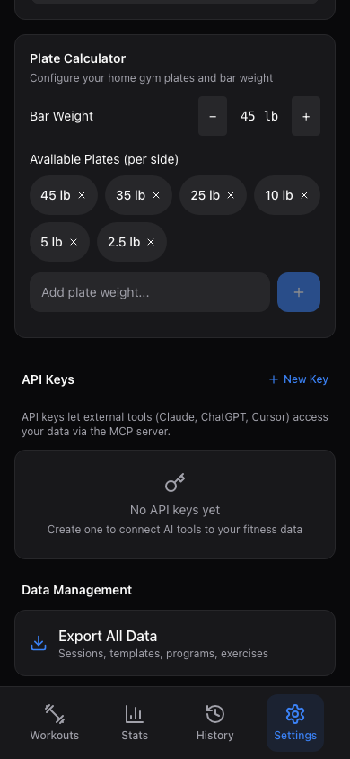
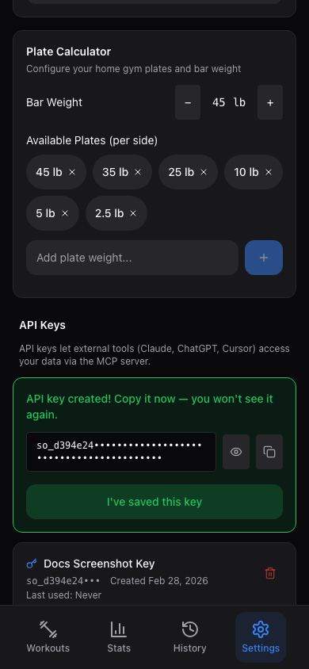

# API Keys and MCP Integration

Sunderos includes a built-in MCP (Model Context Protocol) server that lets AI assistants like Claude and ChatGPT read and manage your fitness data through natural language. This guide covers generating API keys, configuring the MCP server, and what you can do once it is connected.

---

## What Are API Keys For?

API keys let external tools access your Sunderos data securely. Instead of sharing your username and password, you create a dedicated key that:

- Grants the same access as your logged-in account
- Can be revoked at any time without changing your password
- Has an optional expiration date
- Is tracked so you can see when it was last used

The most common use case is connecting the MCP server to Claude Code, Claude Desktop, Cursor, or ChatGPT so you can ask questions about your training data in plain English.

---

## Generating an API Key

1. Open the app and go to the **Settings** tab (bottom navigation bar, far right).
2. Scroll down to the **API Keys** section.
3. Tap **New Key**.
4. Enter a descriptive name for the key (e.g., "Claude Code" or "ChatGPT").
5. Optionally set an **expiration date**. If you leave this blank, the key never expires.
6. Tap **Create Key**.



A green banner will appear showing your new key. It starts with `so_` followed by a long string of characters.

> **Important:** Copy the key immediately and store it somewhere safe. The full key is shown only once. After you dismiss the banner, you will only see the first few characters (`so_xxx...`) for identification.

7. Tap the **copy button** next to the key to copy it to your clipboard.
8. Tap **I've saved this key** to dismiss the banner.



### Managing Existing Keys

Your existing keys are listed below the creation form. Each entry shows:

- The key name and prefix (`so_xxx...`)
- When it was created
- When it was last used (or "Never")
- Whether it has expired

To revoke a key, tap the **trash icon** next to it. You will be asked to confirm. Any integrations using that key will immediately stop working.

---

## Configuring the MCP Server

The MCP server is a lightweight bridge between AI assistants and the Sunderos API. It supports two transport modes:

| Mode | Best for | How it works |
|------|----------|-------------|
| **stdio** (default) | Claude Code, Cursor, local tools | Runs as a subprocess; communicates over stdin/stdout |
| **http** | ChatGPT, remote clients | Runs as an HTTP server on a configurable port |

### Environment Variables

The MCP server needs two environment variables:

| Variable | Required | Description |
|----------|----------|-------------|
| `SUNDEROS_API_KEY` | Yes | The API key you generated above (the full `so_...` string) |
| `SUNDEROS_API_URL` | Yes | URL of your Sunderos instance (e.g., `https://your-site.example.com`) |

---

### Setup for Local AI Tools (stdio)

The easiest way to set up the MCP server is with `npx` — no need to install anything. Add the following to your `.mcp.json` file:

```json
{
  "mcpServers": {
    "sunderos": {
      "command": "npx",
      "args": ["-y", "sunderos-mcp@latest"],
      "env": {
        "SUNDEROS_API_KEY": "so_your_key_here",
        "SUNDEROS_API_URL": "https://your-site.example.com"
      }
    }
  }
}
```

This works with any tool that supports the MCP standard, including Claude Code, Claude Desktop, Gemini CLI, Cursor, Windsurf, and others. Check your tool's documentation for where it looks for `.mcp.json` — common locations include the project root directory or a global config path like `~/.claude.json`.

---

## Available MCP Tools

Once connected, the AI assistant has access to 24 tools organized by domain. You do not need to call these tools directly -- just ask questions or give instructions in natural language, and the assistant will use the right tool automatically.

### Exercises (3 tools)

| Tool | What it does |
|------|-------------|
| `list_exercises` | Search and filter exercises by name, muscle group, or equipment |
| `create_exercise` | Add a new custom exercise to your library |
| `delete_exercise` | Remove a custom exercise you created |

### Workout Templates (6 tools)

| Tool | What it does |
|------|-------------|
| `list_templates` | List all your workout templates (plans) |
| `get_template` | View full details of a template including exercises and set schemes |
| `create_template` | Create a new workout template with exercises and set/rep targets |
| `update_template` | Modify an existing template (name, exercises, sets, etc.) |
| `delete_template` | Delete a workout template |
| `swap_exercise` | Replace one exercise with another in a single template, or across every template in a program — set schemes, rest, and supersets are preserved |

### Training Programs (6 tools)

| Tool | What it does |
|------|-------------|
| `list_programs` | List all programs and see which one is active |
| `get_program` | View a program's full schedule (weeks, days, assigned templates) |
| `create_program` | Build a new multi-week training program |
| `update_program` | Modify a program's schedule or details |
| `delete_program` | Delete a training program |
| `activate_program` | Set a program as your active training program |

### Workout History and Stats (4 tools)

| Tool | What it does |
|------|-------------|
| `get_workout_history` | View recent workout sessions with duration, volume, and exercise count |
| `get_workout_details` | See every set logged in a specific workout session |
| `get_exercise_stats` | Get PR history, best weight, estimated 1RM, and volume trends for an exercise |
| `get_prs` | View personal records across all exercises |

### Body Weight (2 tools)

| Tool | What it does |
|------|-------------|
| `log_body_weight` | Record a body weight measurement for a specific date |
| `get_body_weight_history` | View body weight entries and trends over time |

### Autoregulation (1 tool)

| Tool | What it does |
|------|-------------|
| `suggest_weight_adjustments` | Analyze recent RPE data and suggest weight changes for an exercise |

### Data and Status (2 tools)

| Tool | What it does |
|------|-------------|
| `export_data` | Export a summary of all your data (exercises, templates, programs, sessions, body weight) |
| `get_training_summary` | Get a quick overview of your active program, recent workouts, and body weight |

---

## What Can You Do With It?

Once the MCP server is connected, your AI assistant becomes a personal coach that knows your equipment, your history, and your goals. You talk to it in plain English and it reads and writes your Sunderos data directly — no copy-pasting, no manual entry.

Here are some real examples to try.

### Build a Full Program Around Your Equipment

> *I have a home gym with a barbell, squat rack with safety pins, pull-up bar, cable stack (high and low), adjustable dumbbells up to 100 lbs, EZ curl bar, hex bar, and elastic bands. No leg press or machines. Build me a 12-week hypertrophy program — push/pull/legs, 4 days per week, 15-20 sets per session for the main muscle groups. Include warmup sets before heavy compounds.*

The AI will check your exercise library, create any missing exercises for your equipment, build out the templates with set schemes and rep ranges, assemble everything into a multi-week program, and activate it — all in one conversation. You open the app and your first workout is ready to go.

### Adjust a Program After You Start

> *The leg day you made has too much volume, I'm dying by the end. Can you drop it to 14 working sets and swap out the lunges for Bulgarian split squats?*

Because the AI has access to your actual templates, it can pull up the leg day, see exactly what's in it, make the swap, and adjust the set counts. You don't need to describe what's already there.

### Get a Training Check-In

> *Look at my last two weeks of workouts. Am I hitting each muscle group enough? Anything I'm neglecting?*

The AI pulls your recent session history, tallies volume by muscle group, and gives you a straightforward assessment with suggestions — like a coach reviewing your training log.

### Pre-Workout Warmup and Stretching Advice

> *What's my workout today and what should I stretch for?*

The AI looks up your active program, figures out what day you're on, and tells you today's scheduled workout. Then — because it knows which muscle groups that session targets — it gives you a tailored stretching and warmup routine specific to today's exercises. Pull day? It'll suggest lat stretches, dead hangs, and bicep stretches. Leg day? Couch stretches, hamstring work, and hip openers.

### Auto-Adjust Weights Based on RPE

> *My bench press has felt easy lately — RPE 6-7 on sets that should be 8. Should I go up in weight?*

It checks your recent bench press sets, looks at the logged RPE values, and suggests a specific weight increase based on your actual performance data.

### Quick Day-to-Day Questions

These work great for fast check-ins mid-session or between workouts:

- "What's my bench press PR?"
- "What did I do last push day?"
- "Log my body weight as 185 lbs."
- "Show me my squat progress over the last 3 months."
- "What exercises do I have for back?"
- "Add a new exercise: Meadows Row, back, barbell."

### Export Everything for a Real Coach

> *Export all my training data — I want to send it to my coach so they can see what I've been doing.*

The AI exports your full history (exercises, templates, programs, sessions, body weight) in a structured format you can share.

---

## Troubleshooting

**"API requests will fail authentication" warning**
The `SUNDEROS_API_KEY` environment variable is not set or is empty. Double-check that you pasted the full key starting with `so_`.

**"No exercise found" or empty results**
Your account may not have any data yet. Start by logging a few workouts in the app, then try again.

**Connection refused errors**
Make sure your Sunderos instance is running and that `SUNDEROS_API_URL` points to the correct address.

**Key stopped working**
The key may have been revoked or expired. Check the API Keys section in Settings. Generate a new key if needed.
