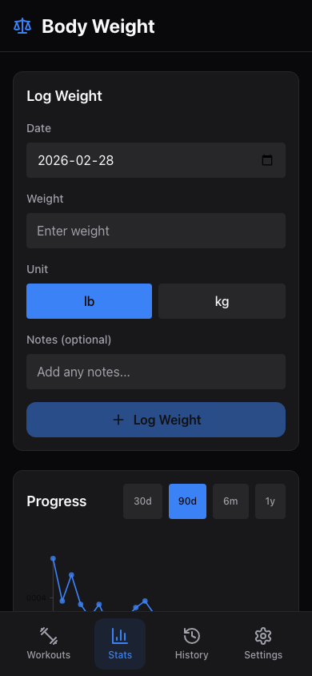

# Body Weight Tracking

The Body Weight page lets you log your weight over time and visualize your progress with a chart. Whether you're bulking, cutting, or maintaining, this helps you stay on track.

---

## Logging a Weight Entry

1. Open the **Body Weight** page from the **Stats** tab (tap the body weight card at the bottom of the dashboard).
2. Fill in the **Log Weight** form:
   - **Date** -- defaults to today. Tap to change if you're logging a past measurement.
   - **Weight** -- enter your weight (supports one decimal place, e.g. 185.5).
   - **Unit** -- toggle between **lb** and **kg** using the two buttons.
   - **Notes** (optional) -- add context like "morning, fasted" or "post-workout".
3. Tap **Log Weight** to save.

A green confirmation message appears briefly when the entry is saved.

> **Tip:** For the most consistent readings, weigh yourself at the same time each day -- most people prefer first thing in the morning before eating.

---

## Viewing the Progress Chart

Once you have logged entries, a **Progress** chart appears showing your weight over time as a line graph.

### Chart Period Filters

Use the period buttons in the top-right corner of the chart to adjust the time range:

| Filter | Time Range |
|--------|-----------|
| **30d** | Last 30 days |
| **90d** | Last 90 days (default) |
| **6m** | Last 6 months |
| **1y** | Last year |

The chart and stats update immediately when you change the period.

### Summary Stats

Below the chart, three stat boxes show:

- **Current** -- your most recent weight reading
- **Min** -- lowest weight in the selected period
- **Max** -- highest weight in the selected period

### Trend Indicator

A colored banner shows the net change over the selected period:

- **Green with a down arrow** -- weight has decreased (or stayed the same)
- **Red with an up arrow** -- weight has increased

The number shows the exact change (e.g. "-2.3" or "+1.5").

> **Note:** The trend indicator shows weight *change*, not whether the change is good or bad. Whether gaining or losing is your goal depends on your training phase.

---

## Browsing Recent Entries

Below the chart (or below the log form if you have no chart data yet), you'll see a **Recent Entries** list showing your most recent weight logs.

Each entry displays:

- Weight and unit (e.g. "185.5 lb") -- numbers display cleanly without trailing zeros
- Date (e.g. "Mon, Feb 3")
- Notes (if any)

### Deleting an Entry

To remove an incorrect entry:

1. Find the entry in the Recent Entries list.
2. Tap the trash icon on the right side.
3. Confirm the deletion in the popup dialog.

The chart and stats will update after the entry is removed.

---

## Next Steps

- [Dashboard & Stats](dashboard-and-stats.md) -- return to your training overview
- [Workout History](history.md) -- review past sessions
- [Settings](settings.md) -- change your default weight unit
