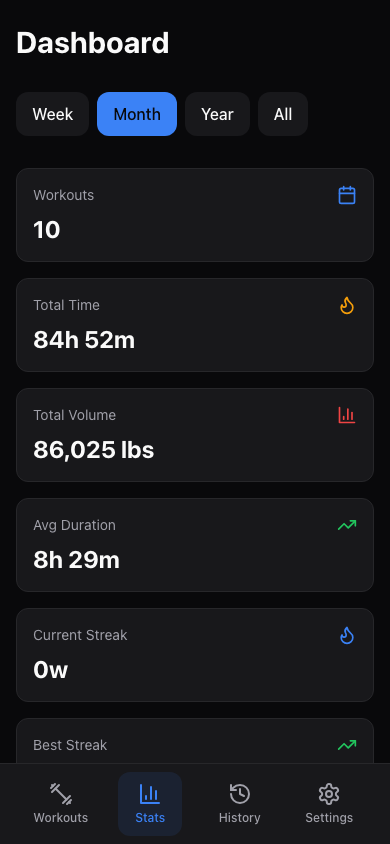
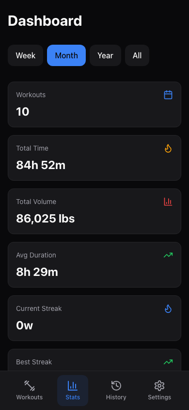
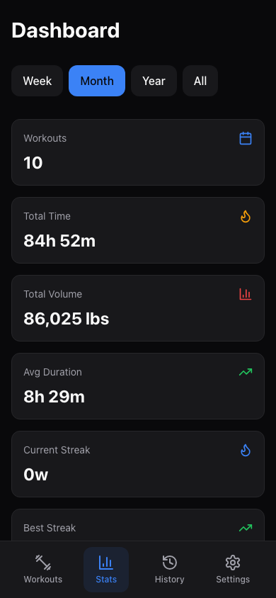

# Dashboard & Stats

The Dashboard is your training home base. It shows you how your workouts are going at a glance -- how often you train, how much volume you're moving, and which muscle groups are getting the most attention.

---

## Choosing a Time Period

At the top of the Dashboard, you'll see four filter buttons:

- **Week** -- stats from the current week only
- **Month** -- stats from the current month
- **Year** -- stats from the current year
- **All** -- your entire training history

Tap any button to update all the stat cards below.

---

## Stat Cards

Six cards summarize your training for the selected period:

| Card | What It Shows |
|------|--------------|
| **Workouts** | Total number of completed sessions |
| **Total Time** | Combined duration of all sessions (e.g. "3h 45m") |
| **Total Volume** | Total weight lifted across all sets (weight x reps), shown in lbs |
| **Avg Duration** | Average length of a single workout |
| **Current Streak** | How many consecutive weeks you've trained at least once |
| **Best Streak** | Your longest-ever weekly training streak |

> **Tip:** Streaks are measured in weeks. As long as you complete at least one workout each week, your streak keeps growing.

---

## Volume by Muscle Group

This stacked bar chart breaks down your training volume by muscle group over the last 8 weeks. Each bar represents one week, and the colored segments show how much volume went to each muscle group.

**Reading the chart:**

- Each bar is one week (labeled W1, W2, etc. along the bottom)
- The y-axis shows total volume in lbs
- Segments within each bar are color-coded by muscle group

**Color legend:**

| Color | Muscle Group |
|-------|-------------|
| Blue | Chest |
| Green | Back |
| Amber | Shoulders |
| Red | Legs |
| Purple | Biceps |
| Pink | Triceps |
| Cyan | Core |
| Orange | Glutes |
| Gray | Forearms |
| Violet | Full Body |

A color legend also appears below the chart for quick reference. Use this chart to spot muscle groups you might be neglecting -- if you don't see much green, it might be time for more back work.

---

## Workout Frequency Heatmap

Below the volume chart, a heatmap shows your workout frequency over the past 6 months. Each small square represents one day, organized by month.

**How to read it:**

- Faded squares = no workout that day
- Light-colored squares = 1 workout
- Bright/solid squares = 2+ workouts

A "Less / More" legend appears below the heatmap. Hover over (or tap) any square to see the exact date and workout count.

This is a great way to see your consistency over time and identify patterns in your training schedule.

---

## Body Weight Quick Link

At the bottom of the Dashboard, you'll find a card linking to the **Body Weight** page. Tap it or the "Log Weight" button to jump straight to the body weight tracker.

See [Body Weight](body-weight.md) for full details on tracking your weight.

---

## Next Steps

- [Workout History](history.md) -- review your past sessions in detail
- [Body Weight](body-weight.md) -- track your weight over time
- [Settings](settings.md) -- customize units, rest timers, and more
