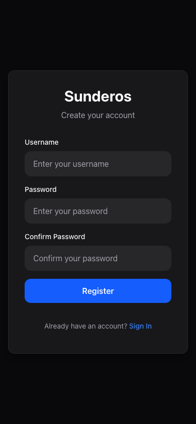
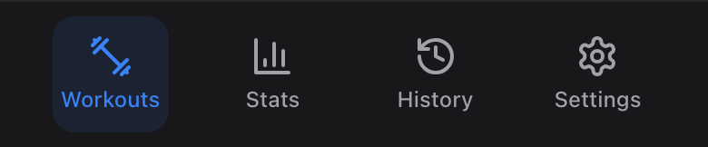
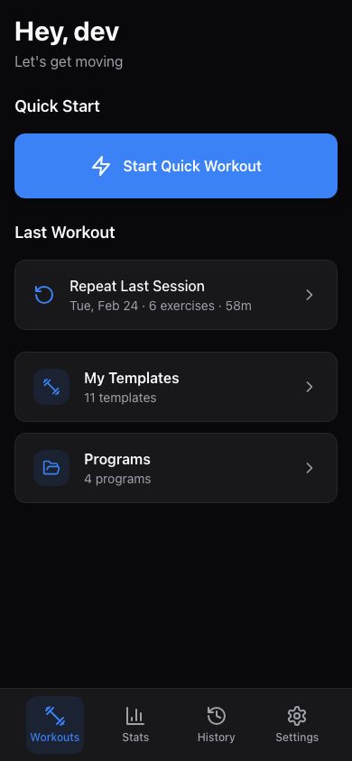

# Getting Started

Welcome to Sunderos -- your personal workout companion. This guide will walk you through creating your account, navigating the app, and getting ready for your first workout.

---

## Use AI as Your Personal Coach

Sunderos connects directly to AI assistants like Claude, Gemini, and ChatGPT through the MCP protocol. That means you can talk to your AI in plain English and it will read and write your actual training data -- building programs, adjusting templates, tracking your progress, and answering questions about your workouts.

Some things you can do:

- **"Build me a 12-week push/pull/legs program for my home gym"** -- Describe your available equipment and goals. The AI creates the exercises, templates, and full program schedule, then activates it. You open the app and your first workout is waiting.
- **"What's my workout today and what should I stretch for?"** -- It checks your active program, figures out today's session, and gives you a warmup routine tailored to the muscle groups you're about to train.
- **"My bench has felt easy lately -- should I go up in weight?"** -- It reviews your recent sets and RPE data and suggests a specific adjustment.

No copy-pasting, no manual data entry. You just talk to it and your app updates in real time. To set it up, see the [API & MCP Guide](api-and-mcp.md).

---

## Creating Your Account

1. Open the app in your browser (or install it as an app -- see the [Install Guide](install-pwa.md)).
2. On the login screen, tap **Register** at the bottom.
3. Choose a **username** (at least 3 characters) and a **password** (at least 8 characters).
4. Type your password again in the **Confirm Password** field.
5. Tap **Register**.

You will be signed in automatically and taken to the Workouts screen.

> **Note:** Registration may use an invisible reCAPTCHA check to prevent abuse. No action is needed on your part -- it runs automatically in the background.

> **Tip:** Already have an account? Tap **Sign In** and enter your username and password instead.

---

## App Overview

Once you are signed in, you will see the bottom navigation bar with four tabs. This is how you move between the main sections of the app.

### The Four Tabs

| Tab | What it does |
|-----|-------------|
| **Workouts** | Your home base. Start a workout, see today's scheduled session, browse your workout plans and programs. |
| **Stats** | View charts and numbers about your training -- total volume, workout frequency, muscle group breakdown, and body weight trends. |
| **History** | Review every past workout session with full details (exercises, sets, weights, reps). |
| **Settings** | Change your preferences (weight units, rest timers), manage your account, and export your data. |

---

## The Workouts Screen

The Workouts tab is the first thing you see after signing in. It is designed to get you into a workout as quickly as possible.

### What You Will Find

- **Greeting** -- A personalized "Hey, [your name]" header.
- **Resume Workout** -- If you left a workout without finishing it, a prominent banner appears so you can pick up right where you left off.
- **Start Quick Workout** -- A large button that immediately opens the active workout screen. You can add exercises on the fly without needing a pre-built plan.
- **Last Workout** -- A shortcut to repeat your most recent session. Shows the date, number of exercises, and how long it took.
- **Today's Workout** -- If you have an active training program, the app shows today's scheduled session (or your next upcoming one) and lets you start it with one tap. On rest days, it displays a "Rest day" message.
- **My Templates** -- A link to your saved workout plans. See [Templates Guide](templates.md) to learn how to create and manage them.
- **Programs** -- A link to your multi-week training programs. See [Programs Guide](programs.md) to set one up.

---

## Quick Orientation

Here is a brief summary of the main areas of the app so you know where everything lives:

### Workout Plans (Templates)

A workout plan (called a "template" in the app) is a saved list of exercises with set and rep targets. Instead of remembering what to do each session, you create a plan once and reuse it. You can start a workout from any plan, or create one from scratch. Read more in the [Templates Guide](templates.md).

### Training Programs

A program organizes multiple workout plans into a weekly schedule across several weeks. For example, a Push/Pull/Legs program might assign different plans to Monday, Wednesday, and Friday. The app tracks where you are in the program and tells you which workout is next. Read more in the [Programs Guide](programs.md).

### Stats and Dashboard

The Stats tab gives you a bird's-eye view of your training progress with charts for workout frequency, muscle group volume, and more. You can filter by time period (week, month, year, or all time). Read more in the [Dashboard and Stats Guide](dashboard-and-stats.md).

### Body Weight Tracking

You can log your body weight over time and see trends on a line chart. Access it from the Stats tab. Read more in the [Body Weight Guide](body-weight.md).

### Workout History

Every completed workout is saved with full details. You can expand any past session to see every exercise, set, weight, and rep you logged. Read more in the [History Guide](history.md).

### Settings

Customize your experience: choose pounds or kilograms, set your default rest timer, change your password, or export all your data as a backup. Read more in the [Settings Guide](settings.md).

---

## What's Next?

You are all set to start training. Here are your suggested next steps:

1. **Start a quick workout** -- Tap "Start Quick Workout" on the Workouts screen and add exercises on the fly. This is the fastest way to get started.
2. **Create a workout plan** -- Head to Templates and build a reusable plan for your favorite routine. See the [Templates Guide](templates.md).
3. **Set up a program** -- Once you have a few plans, combine them into a weekly program. See the [Programs Guide](programs.md).
4. **Adjust your settings** -- Set your preferred weight unit and rest timer durations in Settings. See the [Settings Guide](settings.md).
