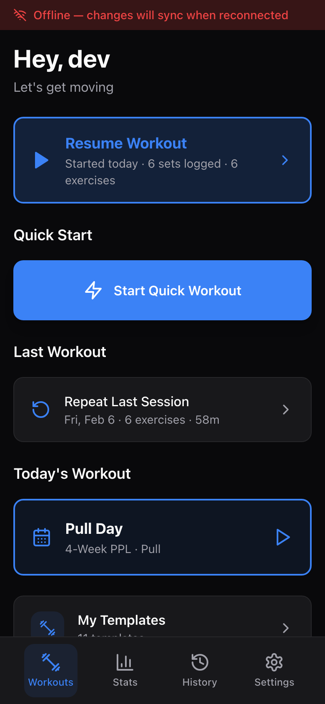

# Installing as a Mobile App (PWA)

Sunderos is a Progressive Web App (PWA), which means you can install it on your phone or tablet and use it just like a native app. Once installed, it appears on your home screen with its own icon, opens in full-screen mode without a browser address bar, and works even when you lose your internet connection.

---

## Installing on iOS (Safari)

Safari is the only browser that supports PWA installation on iOS.

1. Open the Sunderos URL in **Safari** (not Chrome or another browser).
2. Tap the **Share button** at the bottom of the screen (the square with an upward arrow).
3. Scroll down in the share sheet and tap **Add to Home Screen**.
4. You can edit the name if you like -- the default is "Sunderos".
5. Tap **Add** in the top-right corner.

[Screenshot: iOS Safari Share Menu]

[Screenshot: iOS Add to Home Screen Dialog]

The Sunderos icon will now appear on your home screen. Tapping it opens the app in standalone mode -- no Safari toolbar, no address bar, just the app.

> **Note:** On iOS, the app icon is generated from the 192x192 and 512x512 PNG icons bundled with the app. The app uses a dark background (`#09090b`) and displays in portrait orientation.

---

## Installing on Android (Chrome)

1. Open the Sunderos URL in **Chrome**.
2. You may see an **"Install App"** banner at the bottom of the screen. If so, tap **Install** and you are done.
3. If the banner does not appear, tap the **three-dot menu** in the top-right corner of Chrome.
4. Tap **Add to Home Screen** (or **Install App**, depending on your Chrome version).
5. Confirm by tapping **Add** or **Install**.

[Screenshot: Android Chrome Install Prompt]

[Screenshot: Android Add to Home Screen]

The app will appear in your app drawer and home screen. It launches in standalone mode just like a native app.

> **Tip:** On Android, some browsers other than Chrome also support PWA installation (Edge, Samsung Internet). The steps are similar -- look for "Install" or "Add to Home Screen" in the browser menu.

---

## Installing on Desktop (Chrome, Edge)

You can also install the app on your desktop computer.

1. Open the Sunderos URL in Chrome or Edge.
2. Look for the **install icon** in the address bar (a small monitor with a down arrow, or a "+" icon).
3. Click the icon and confirm the installation.

Alternatively, open the three-dot menu and select **Install Sunderos** (or "Install app").

---

## How Offline Mode Works

One of the key benefits of installing as a PWA is offline support. Here is how it works:

### What Gets Cached

When you first load the app, the service worker downloads and caches all of the app's files (HTML, CSS, JavaScript, icons, and fonts). This means the app shell loads instantly on future visits, even without an internet connection.

### API Data Caching

API responses are cached using a **network-first** strategy:

- The app tries to fetch fresh data from the server first.
- If the server responds, the fresh data is shown and cached.
- If the network is unavailable (or takes longer than 5 seconds), the app falls back to the last cached response.

This means the most recent data you viewed will still be available offline.

> **Note:** Authentication, API key, and settings endpoints are never cached for security reasons.

### The Sync Queue

When you are offline and make changes (such as logging a workout or recording body weight), those changes are saved locally in your browser's IndexedDB database. A sync queue tracks everything that needs to be sent to the server.

When your connection comes back:

1. The app detects that you are back online.
2. Pending changes are pushed to the server automatically.
3. Once all changes are synced, the queue clears.

### The Offline Banner

When the app detects that you have no internet connection, a **red banner** appears at the top of the screen:

> "Offline -- changes will sync when reconnected"

If you come back online but there are still pending changes waiting to sync, you will see an **amber banner** instead:

> "[N] changes pending sync"

You can tap the **refresh icon** on the amber banner to manually trigger a sync if you do not want to wait.

Once everything is synced and you are back online, the banner disappears.

---

## Service Worker Updates

The app's service worker uses an **auto-update** strategy. When a new version of the app is deployed:

1. The service worker detects the update in the background.
2. The new version is downloaded and cached.
3. The update activates the next time you open the app (or refresh the page).

You do not need to manually clear your cache or reinstall the app. Updates happen automatically and seamlessly.

> **Tip:** If you ever notice the app behaving unexpectedly, try closing it completely and reopening it. This forces the new service worker to activate.

---

## FAQ

**Can I use the app entirely offline?**
You can view previously loaded data and log workouts offline. The data will sync to the server when you reconnect. However, you need an internet connection for the initial setup (creating an account and loading the app for the first time).

**Does the app work on iPad and Android tablets?**
Yes. The installation steps are the same. The app is designed for portrait orientation but works on any screen size.

**Can I install it on multiple devices?**
Yes. Install it on as many devices as you like. All devices sync to the same server, so your data stays consistent.

**What happens if I clear my browser data?**
If you clear your browser's storage, the locally cached data and any un-synced changes will be lost. Data that was previously synced to the server is safe. You will need to sign in again.

**How do I uninstall the app?**
On iOS, long-press the icon and tap "Remove App." On Android, long-press and drag to "Uninstall" or use your device's app settings. On desktop, right-click the icon or go to the browser's installed apps settings.
