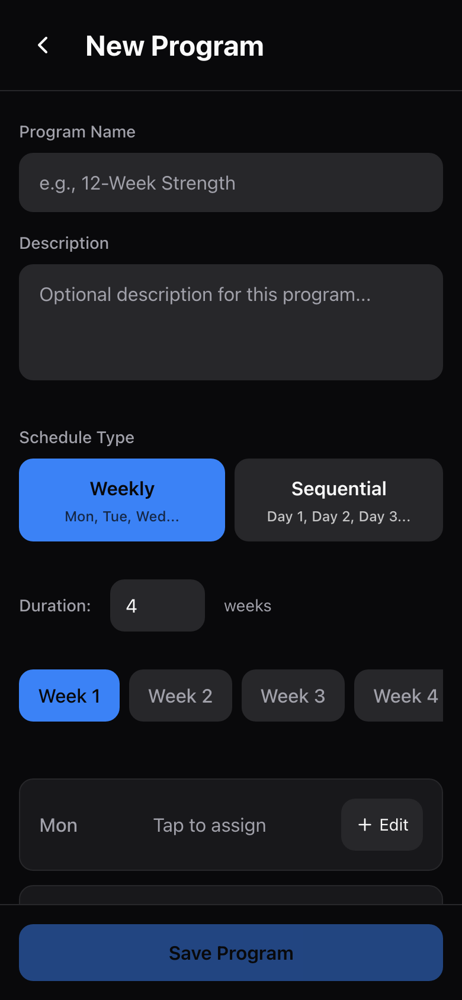
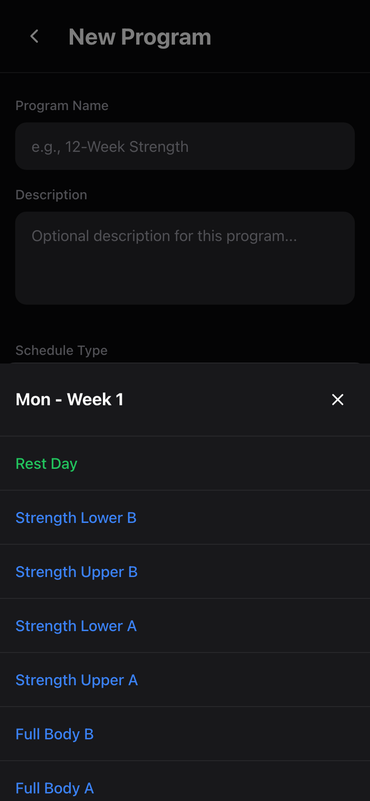
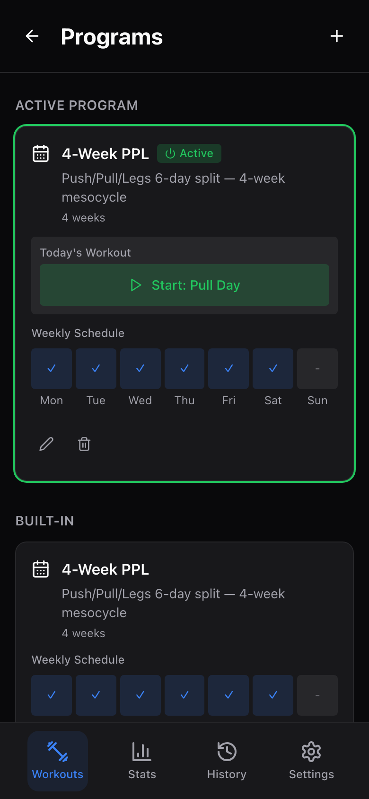
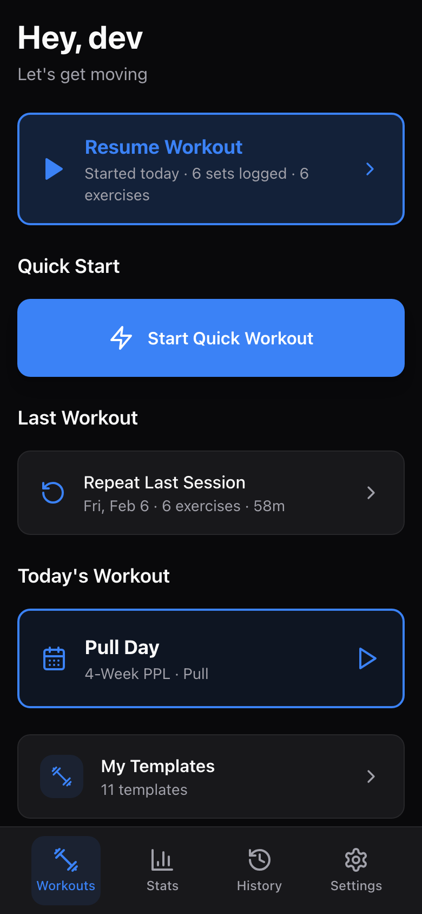

# Training Programs

A training program ties your workout templates together into a structured, multi-week plan. Instead of deciding which template to do each day, you assign templates to specific days and let the app tell you what's next. Programs help you stay consistent and follow a real training plan.

---

## Browsing Programs

Open **Workouts > Programs** from the main screen. Programs are organized into three sections:

- **Active Program** --- the program you're currently following (highlighted with a green border).
- **Built-in** --- ready-made programs that ship with the app.
- **My Programs** --- custom programs you've created.

### Built-in Programs

The app includes four built-in programs:

| Program | Duration | Days/Week | Style |
|---|---|---|---|
| 4-Week PPL | 4 weeks | 6 days | Push/Pull/Legs twice per week, Sunday rest |
| 4-Week Upper/Lower | 4 weeks | 4 days | Upper and Lower twice per week |
| 4-Week Full Body | 4 weeks | 3 days | Alternating Full Body A and B |
| 8-Week Strength | 8 weeks | 4 days | Heavy compound focus with AMRAP tracking |

Each built-in program uses the built-in templates. You can activate any built-in program to start following it right away --- the app will create your own copy so your progress stays separate.

### Weekly Schedule Preview

Each program card shows a weekly schedule preview --- a row of day indicators (Mon through Sun) showing which days have workouts scheduled. Days with a workout show a checkmark; rest days show a dash.

---

## Creating a Custom Program

1. From the programs page, tap the **+** button in the top-right corner.
2. Enter a **name** for your program (required) --- for example, "12-Week Strength" or "Summer Cut."
3. Optionally add a **description**.

### Choosing a Schedule Type

4. Choose your **schedule type**:

   - **Weekly** --- assign templates to specific days of the week (Monday, Tuesday, etc.). Best when you train on the same days each week.
   - **Sequential** --- assign templates to numbered days (Day 1, Day 2, etc.). The app advances through the days in order each time you work out. Best when your training days vary from week to week.

### Setting the Duration

5. Set the program **duration** in weeks (1 to 12 weeks). This determines how many weeks appear in the week tabs.

### Assigning Templates to Days

6. Use the **week tabs** to navigate between weeks. Each week shows all 7 days.
7. For each day, tap the **Edit** button to open the template picker.
8. Choose a template from the list to assign it to that day, or choose **Rest Day** to mark it as a rest day.
9. To clear a day's assignment, tap the **X** button next to it.

In **weekly mode**, days are labeled by their name (Mon, Tue, Wed, etc.). In **sequential mode**, days are labeled by number (Day 1, Day 2, etc.).

> **Tip:** You need to create your templates first before you can assign them to program days. If the template picker shows "No templates available," go to [Templates](templates.md) and create some first.

### Copying Week 1 to All Weeks

If every week in your program follows the same schedule (which is common), tap the **Copy Week 1** button to copy your Week 1 assignments to all other weeks. This saves you from manually setting up each week individually.

### Multi-week Variation

If your training varies from week to week (for example, heavier weeks followed by a deload), set up each week individually using the week tabs. You can assign different templates to the same day across different weeks.

---

## Saving Your Program

Tap the **Save Program** button at the bottom of the screen. The program name is required --- the button is disabled until you enter one.

---

## Activating a Program

Only one program can be active at a time. To activate a program:

1. Go to the **Programs** page.
2. Tap the **Activate** button on the program you want to follow.
3. The program moves to the "Active Program" section and is highlighted with a green border and an "Active" badge.

When you activate a built-in program, the app creates your own personal copy so your progress is tracked independently.

Activating a new program automatically deactivates any previously active program.

---

## Today's Workout

Once you have an active program, the app automatically determines your next workout. This appears on the **Workouts** main screen.

### How It Works (Weekly Mode)

In weekly mode, the app checks which day of the week it is and looks up what template is assigned to today. If today has a workout scheduled and you haven't completed it yet, it appears as **"Today's Workout"** with a green Start button.

If today's workout is already done, or it's a rest day, the app looks ahead to find your **next upcoming workout** and shows it under "Next: [Day Name]."

### How It Works (Sequential Mode)

In sequential mode, the app keeps track of a **current day index** that advances each time you complete a workout. It always shows the next workout in your sequence, regardless of what calendar day it is. This is ideal if you don't train on fixed days.

### Starting Today's Workout

From the Workouts main screen, tap the workout card to jump straight into the session with the correct template pre-loaded. See the [Workouts Guide](workouts.md) for details on the active workout screen.

---

## Editing a Program

1. Go to the **Programs** page.
2. Tap the **pencil icon** on the program card.
3. Make your changes in the program builder --- rename it, add/remove weeks, change template assignments.
4. Tap **Save Program**.

> **Note:** You can only edit programs you've created. Built-in programs cannot be edited directly. Activate a built-in program first to create your own copy, then edit that copy.

---

## Deleting a Program

1. Go to the **Programs** page.
2. Tap the **trash icon** on the program card. A confirmation message will appear.
3. Tap **Delete** to permanently remove the program.

Built-in programs cannot be deleted. Deleting a program does not affect any past workout sessions.

---

## Program Tips

- **Start simple.** If you're new, activate one of the built-in programs and follow it for a full cycle before creating your own.
- **Templates first.** Always create your workout templates before building a program, since programs are built from templates.
- **Copy Week 1.** For programs where every week is the same, use the "Copy Week 1" button to save time.
- **Sequential for flexible schedules.** If your gym days change from week to week, use sequential mode so the app just tells you what's next in the rotation.
- **Deload weeks.** For multi-week programs, consider making the last week lighter by assigning templates with lower volume or fewer exercises.

---

## Next Steps

- [Templates Guide](templates.md) --- Learn how to create and customize workout templates.
- [Workouts Guide](workouts.md) --- Learn how to log sets and complete a workout session.
- [Dashboard & Stats](dashboard-and-stats.md) --- See how your training volume and frequency are tracked over time.
