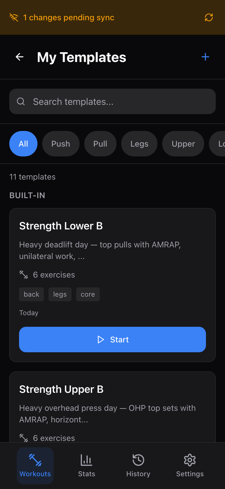
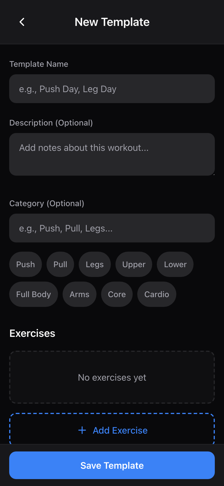
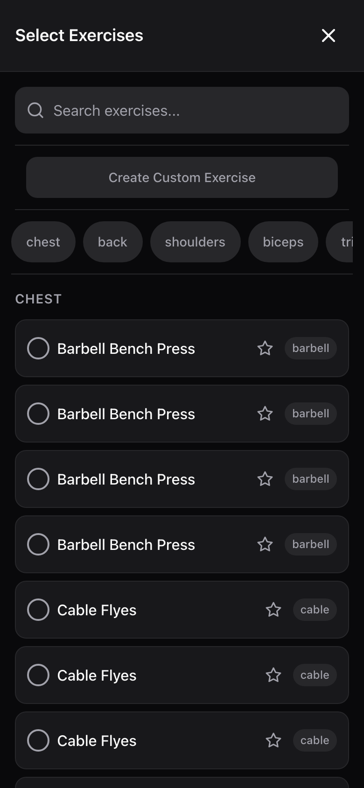
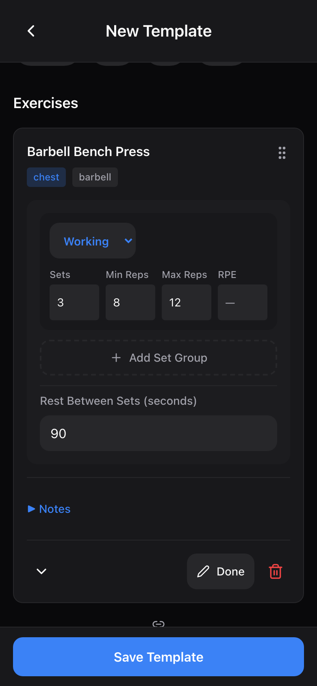

# Workout Templates

A workout template is a reusable blueprint for a training session. Instead of building your workout from scratch every time, you create a template once --- pick the exercises, set up rep ranges and set types --- and then start it whenever you're ready to train. Templates save time and keep your training consistent.

---

## Browsing Templates

Open **Workouts > My Templates** from the main screen. You'll see two sections:

- **Built-in** --- ready-made templates that come with the app. These cover several popular training styles (details below).
- **My Templates** --- any custom templates you've created.

### Built-in Templates

The app ships with 11 built-in templates organized across four training styles:

| Template | Category | Focus |
|---|---|---|
| Push Day | Push | Chest, shoulders, triceps |
| Pull Day | Pull | Back, biceps |
| Legs Day | Legs | Quads, hamstrings, glutes, calves |
| Upper Body | Upper | Full upper-body push/pull |
| Lower Body | Lower | Full lower-body compound + isolation |
| Full Body A | Custom | Squat-focused full-body session |
| Full Body B | Custom | Deadlift-focused full-body session |
| Strength Upper A | Upper | Heavy bench focus |
| Strength Upper B | Upper | Heavy overhead press focus |
| Strength Lower A | Lower | Heavy squat focus |
| Strength Lower B | Lower | Heavy deadlift focus |

Built-in templates use a mix of set types (warmups, working sets, backoff sets, drop sets, and AMRAP sets) and include supersets. You can start a workout from any built-in template, but you cannot edit or delete them.

### Searching and Filtering

Use the **search bar** at the top of the templates page to find a template by name. Below the search bar, **category tabs** let you filter by category:

- All, Push, Pull, Legs, Upper, Lower, Custom

Tap a tab to show only templates in that category. The count below the tabs updates to reflect how many templates match your current filter.

---

## Creating a Custom Template

1. From the templates page, tap the **+** button in the top-right corner to open the template builder.
2. Give your template a **name** (required) --- for example, "Push Day" or "Arm Blaster."
3. Optionally add a **description** to remind yourself what the session is about.
4. Pick a **category** by tapping one of the quick-select buttons (Push, Pull, Legs, Upper, Lower, Full Body, Arms, Core, Cardio) or type your own.

### Adding Exercises

5. Tap **Add Exercise** to open the exercise picker.
6. Browse exercises by muscle group using the filter chips, or type in the search bar to find a specific exercise.
7. Tap exercises to select them --- a checkmark appears next to each selected exercise. You can select multiple exercises at once.
8. Tap the **Add N Exercises** button at the top to add them all to your template.

> **Tip:** You can also create a brand new custom exercise from the exercise picker. Tap "Create Custom Exercise," fill in the name, muscle group, and equipment, then save it.

> **Tip:** Star your most-used exercises as favorites so they appear at the top of each muscle group in the picker.

### Configuring Set Schemes

Each exercise starts with a default set scheme of 3 working sets of 8-12 reps. To customize it:

9. Tap the **Edit** button on the exercise card.
10. You'll see fields for each set group:
    - **Type** --- choose from Warmup, Working, Backoff, Drop Set, or AMRAP using the dropdown.
    - **Sets** --- how many sets of this type (1-10).
    - **Min Reps** --- the low end of your target rep range.
    - **Max Reps** --- the high end of your target rep range.
    - **RPE** --- an optional target Rate of Perceived Exertion (1-10 scale, whole numbers only). Leave blank if you don't use RPE.
11. Tap **Add Set Group** to add another set group to the same exercise. For example, you might have 2 warmup sets followed by 3 working sets followed by 1 AMRAP set.
12. To remove a set group, tap the **X** button next to it (you must keep at least one set group per exercise).

### Understanding Set Types

| Set Type | What It Means |
|---|---|
| **Warmup** | Lighter sets to prepare for working weight. |
| **Working** | Your main training sets at full intensity. |
| **Backoff** | Lighter sets after your working sets for extra volume. |
| **Drop Set** | Immediately reduce weight after a set and continue repping. |
| **AMRAP** | As Many Reps As Possible --- push to near-failure on the last set. |

### Setting Rest Times

While in edit mode, scroll down to the **Rest Between Sets** field and enter your preferred rest time in seconds. The value adjusts in 15-second increments. The default is 90 seconds.

### Adding Exercise Notes

Tap **Notes** on any exercise card to expand the notes area. Type any cues, reminders, or instructions you want to see during the workout --- for example, "Squeeze at the top" or "Pause 1 second at the bottom."

### Reordering Exercises

Use the **up/down arrows** at the bottom of each exercise card to change the order. Exercises are performed in the order they appear in the template.

### Removing an Exercise

Tap the **trash icon** on the exercise card. You'll see a confirmation prompt before the exercise is removed.

---

## Supersets

A superset is two or more exercises performed back-to-back with minimal rest between them. To create a superset:

1. Add the exercises you want to superset so they are adjacent in the list.
2. Tap the **link icon** between two adjacent exercises to group them into a superset.
3. The linked exercises will be highlighted with a colored border and a "SUPERSET" label.

To remove an exercise from a superset, either:
- Tap the **link icon** between the two exercises again to unlink them, or
- Tap the **unlink icon** on the individual exercise card.

[Screenshot: Two exercises linked as a superset in the template builder]

> **Note:** Supersets are shown grouped together during your workout so you know which exercises to perform back-to-back.

---

## Saving Your Template

Once you've configured everything, tap the **Save Template** button at the bottom of the screen. You'll be taken back to the templates list where your new template will appear under "My Templates."

The template must have a name and at least one exercise before it can be saved.

---

## Editing a Template

1. Go to **My Templates** and find the template you want to edit.
2. Tap the **pencil icon** on the template card.
3. Make your changes in the template builder --- add/remove exercises, adjust set schemes, rename the template, etc.
4. Tap **Save Template** to save your changes.

> **Note:** You can only edit templates you've created. Built-in templates cannot be edited.

---

## Deleting a Template

1. Go to **My Templates** and find the template you want to delete.
2. Tap the **trash icon** on the template card.
3. Confirm the deletion when prompted.

Deleting a template does not affect any past workout sessions that used it. Built-in templates cannot be deleted.

---

## Starting a Workout from a Template

From the templates list, tap the **Start** button on any template card. This opens the active workout screen pre-loaded with all the exercises and set schemes from that template. See the [Workouts Guide](workouts.md) for details on logging sets during a workout.

---

## Next Steps

- [Workouts Guide](workouts.md) --- Learn how to log sets, track weight, and complete a workout session.
- [Programs Guide](programs.md) --- Organize your templates into a multi-week training program.
