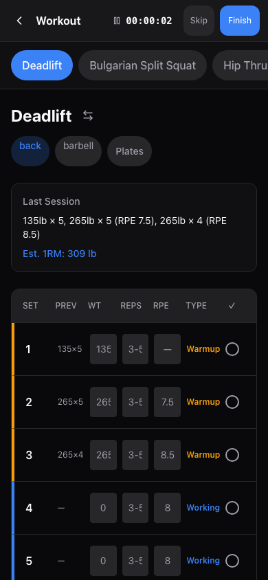
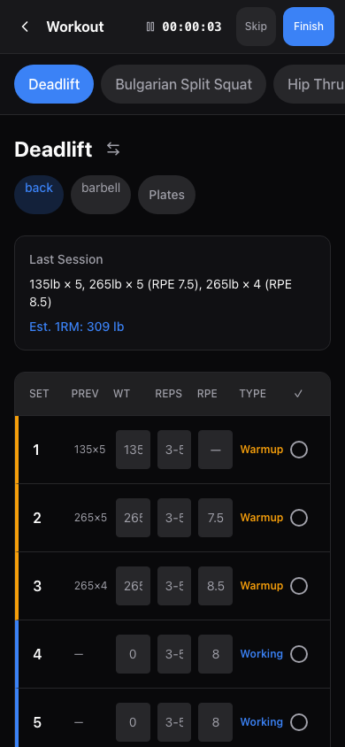
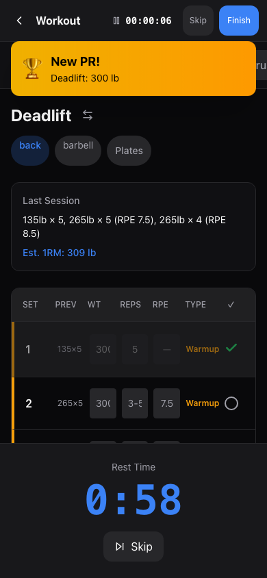
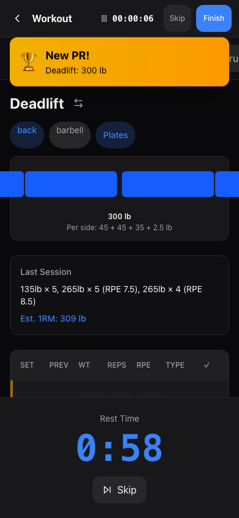
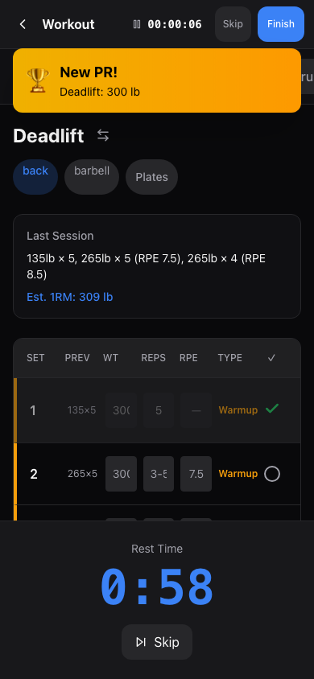
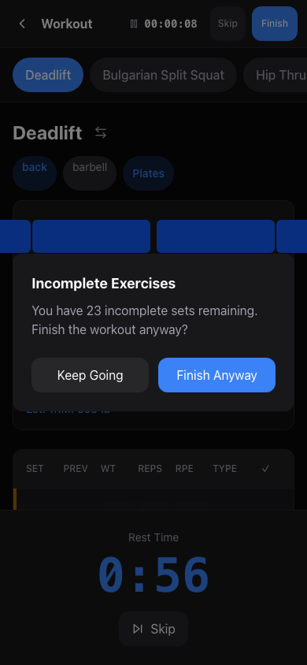

# Workouts

This guide covers everything about running a workout -- from starting a session to logging your sets and finishing up.

---

## Starting a Workout

There are several ways to begin a workout from the Workouts screen:

### Quick Workout (No Plan)

1. Tap **Start Quick Workout**.
2. The active workout screen opens with no exercises loaded.
3. Tap **Add Exercise** to pick exercises from the library and start logging.

This is great when you want to freestyle your session without a pre-built plan.

### From a Workout Plan (Template)

1. On the Workouts screen, tap **My Templates** to browse your saved plans.
2. Find the plan you want and tap **Start**.
3. The active workout screen opens with all the exercises and set targets from that plan pre-loaded.

> **Tip:** You can also start a workout plan directly from the [Templates](templates.md) page.

### From Your Program Schedule

If you have an active training program, the Workouts screen shows your next scheduled session:

1. Look for the **Today's Workout** section (or "Next: [day]" if today is a rest day).
2. Tap the workout card to start that session.

The app automatically figures out which workout is next based on the day of the week and what you have already completed today.

### Repeat Last Workout

1. Under **Last Workout**, tap **Repeat Last Session**.
2. The same plan from your most recent workout loads into a new session.

---

## The Active Workout Screen

Once you start a workout, you enter the active workout screen. This is a full-screen experience designed to keep you focused.

### Header

At the top you will find:

- **Back arrow** -- Leave the workout (you will be prompted to confirm if you have logged any sets).
- **Timer** -- A running clock showing how long you have been working out (hours:minutes:seconds). Tap the timer to pause it -- the display turns yellow with a play icon. Tap again to resume. The pause state syncs to the server, so if you close the app, clear your cache, or pick the workout back up on another device, the timer resumes frozen at the exact same elapsed time. If you leave the workout via the back button, the timer pauses automatically so time away does not count.
- **Skip** -- Finish the workout immediately. The session is marked as done on the server with a "Skipped" note. For sequential programs, Skip advances to the next workout day.
- **Finish** -- End the workout and save your session.

### View Modes

The app offers two ways to view your exercises:

- **Tabbed mode** (default) -- Shows one exercise at a time. Use the exercise tabs at the top to switch between exercises.
- **Scroll mode** -- Shows all exercises stacked vertically on one page. Scroll up and down to see everything.

You can change your preferred view mode in [Settings](settings.md).

---

## Exercise Navigator (Tabbed Mode)

In tabbed mode, a scrollable row of exercise tabs appears below the header. Each tab shows an exercise name with visual indicators:

- **Highlighted (blue)** -- The exercise you are currently viewing.
- **Green** -- All sets for that exercise are completed.
- **Light blue** -- Some sets are completed.
- **Gray** -- No sets completed yet.

Tap any tab to jump to that exercise. A **+** button at the end lets you add more exercises mid-workout.

### Superset Indicators

If exercises are grouped as a superset, their tabs appear linked together with a small chain icon between them. The app handles superset flow automatically (more on this below).

---

## Logging Sets

Each exercise shows a table of sets to complete. For each set, you will see columns for:

| Column | Description |
|--------|-------------|
| **Set** | The set number (1, 2, 3...). |
| **Prev** | What you did last time for this set (weight x reps). Gives you a quick reference. |
| **WT** | Weight input. Enter the weight you are using. For bodyweight exercises (pull-ups, dips, sit-ups, etc.), you can leave this empty and just enter reps. |
| **Reps** | Reps input. Enter how many reps you completed. |
| **RPE** | Rate of Perceived Exertion (1-10 scale, half values like 7.5 and 8.5 are supported). Optional -- how hard the set felt. |
| **Type** | The set type (warmup, working, backoff, drop, or AMRAP), shown with a color-coded left border. |
| **Checkmark** | Tap the circle to mark the set as complete. |

### How to Log a Set

1. Enter the **weight** you are lifting. For bodyweight exercises, you can leave this empty.
2. Enter the **reps** you completed.
3. Optionally enter an **RPE** value (1-10, half values like 7.5 supported, where 10 is maximum effort).
4. Tap the **circle** on the right to mark the set as done.

The circle turns into a green checkmark, and the row dims to show it is complete.

### Undoing a Completed Set

Changed your mind or logged the wrong values? Tap the green checkmark on a completed set to uncheck it. The set row becomes editable again so you can update the weight, reps, or RPE. If the set had already been synced to the server, the app removes it from the server as well -- so your history stays accurate.

### Auto-Fill and Placeholders

The app helps you fill in values faster:

- **Weight** -- Pre-fills with the weight from your previous completed set in this session. If this is your first set, it uses the weight from your last session for this exercise.
- **Reps** -- Shows the target rep range from your plan (e.g., "8-12") as a placeholder. If no plan target exists, it uses your previous session's reps.
- **RPE** -- Shows the target RPE from your plan if one is set, otherwise your last session's RPE.

If you tap the checkmark without typing anything, the app uses these placeholder values automatically.

---

## Logging Cardio Sets

Cardio exercises (treadmill, rowing machine, assault bike, etc.) swap the strength columns for cardio-specific ones. The exercise header shows a red activity icon and a **CARDIO** badge, and the set table has these columns instead of WT/Reps/RPE:

| Column | Description |
|--------|-------------|
| **Set** | The round number (1, 2, 3...). |
| **Prev** | The duration you logged for this round last time. |
| **Dur** | Duration input as `mm:ss` or `h:mm:ss` (e.g. `0:20`, `1:30`, `30:00`). The placeholder shows the target from your template. |
| **Dist** | Distance covered, entered in your preferred unit (km, mi, or m --- see [Settings](settings.md)). Optional. |
| **Pace** | Calculated automatically from duration and distance (e.g. `5:30/km`). Read-only. |
| **Type** | Set type, same colour-coded options as strength sets. |
| **Checkmark** | Tap the circle to mark the round as complete. |

The rest timer and set-type behaviour work the same as strength exercises. Plate calculator and 1RM estimates are hidden for cardio. Volume totals on the finish screen exclude cardio rounds (they have no weight), but session duration still includes them.

[Screenshot: Active workout screen showing a cardio exercise with Dur/Dist/Pace columns]

---

## Adding and Removing Sets

Every exercise card has **Add Set** and **Remove Set** buttons at the bottom of the set table.

- **Add Set** -- Appends a new working set that matches the exercise's target rep range. Use this when you want to do more sets than your plan calls for.
- **Remove Set** -- Removes the last uncompleted set. If all sets are already completed, it removes the last set. A minimum of 1 set per exercise is enforced, so you cannot remove the only remaining set.

---

## Set Types

Sets are color-coded by type so you can see at a glance what kind of work you are doing:

| Type | Color | Purpose |
|------|-------|---------|
| **Warmup** | Yellow/amber | Lighter sets to prepare your muscles. |
| **Working** | Blue | Your main strength work at target intensity. |
| **Backoff** | Gray | Reduced-intensity sets after your main work. |
| **Drop** | Red | Drop sets with reduced weight, no rest between drops. |
| **AMRAP** | Green | As Many Reps As Possible -- push to near-failure. |

Set types are defined in your workout plan. During the workout, the type is shown as a label in each row and as a colored left border.

---

## Rest Timer

After you complete a set, a rest timer automatically appears at the bottom of the screen. It counts down based on the set type you just finished:

- **Warmup:** 60 seconds
- **Working:** 90 seconds
- **Backoff:** 60 seconds
- **Drop:** 45 seconds
- **AMRAP:** 120 seconds

These are the defaults -- you can customize each one in [Settings](settings.md).

When the timer reaches zero:
- Your phone vibrates (if supported).
- A short beep plays.
- The timer disappears automatically.

Tap **Skip** on the timer overlay if you are ready to go before it runs out.

---

## Previous Performance

For each exercise, the app shows what you did last time:

- **In tabbed mode:** A "Last Session" card appears above the set table showing the weight, reps, and RPE for each set from your most recent session with this exercise. It also calculates an estimated 1-rep max (1RM).
- **In scroll mode:** A compact "Last:" line appears below each exercise header.
- **In the "Prev" column:** Each row shows the specific weight x reps from the corresponding set in your last session.

This makes progressive overload easy -- you always know what you need to beat.

---

## Plate Calculator

For barbell exercises, a **Plates** button appears next to the muscle group and equipment tags. Tap it to see a visual breakdown of which plates to load on each side of the bar.

The calculator:
- Takes your target weight and subtracts the bar weight (default 45 lb).
- Divides the remaining weight by 2 (for each side).
- Shows a visual barbell diagram with color-coded plates.
- Lists the plates needed per side (e.g., "Per side: 45 + 25 + 5 lb").
- Warns you if the exact target weight is not achievable with your available plates and suggests the nearest possible weight.

You can customize your bar weight and available plate sizes in [Settings](settings.md).

---

## Supersets

Supersets let you pair two or more exercises to perform back-to-back with no rest between them. They are set up in your workout plan (see [Templates Guide](templates.md)).

### How Supersets Work During a Workout

1. **Complete a set** on exercise A.
2. The app **automatically switches** to exercise B (no rest timer fires).
3. **Complete a set** on exercise B.
4. The **rest timer starts** after the last exercise in the group finishes a set (one "round" is complete).
5. After rest, the app cycles back to exercise A for the next round.

**Example flow for a two-exercise superset:**
- Bench Press set 1 -> Bent-Over Row set 1 -> REST -> Bench Press set 2 -> Bent-Over Row set 2 -> REST -> ...

### Visual Indicators

- **Tabbed mode:** Superset partners appear linked in the exercise navigator with chain icons and are highlighted in red. A "SUPERSET" banner with quick-switch buttons appears above the current exercise.
- **Scroll mode:** Superset exercises are wrapped together in a red-bordered container labeled "SUPERSET."

---

## Personal Records (PRs)

The app automatically checks for personal records every time you complete a set. If you hit a new PR, a notification slides in from the top showing:

- The exercise name.
- Whether it is a new **weight PR** (heaviest weight ever lifted) or a new **estimated 1RM PR**.
- The new record value.

The notification disappears after a few seconds. All your PRs are saved and viewable in the Stats section.

---

## Adding Exercises Mid-Workout

You are not locked into the exercises from your plan. To add a new exercise during a workout:

1. **Tabbed mode:** Tap the **+** button at the end of the exercise tab bar.
2. **Scroll mode:** Tap the **+ Add Exercise** button at the bottom of the exercise list.
3. The exercise picker opens. Search or browse by muscle group.
4. Tap an exercise to add it.

The new exercise is added with 3 working sets (6-12 rep range) by default. You can add or remove sets as needed.

> **Tip:** See the [Templates Guide](templates.md) to learn about favoriting exercises so your go-to movements appear at the top of the picker.

---

## Swapping Exercises

If you want to replace an exercise mid-workout (maybe a machine is taken, a form issue flares up, or you want a variation):

1. Tap the **swap icon** (arrows) next to the exercise name.
2. The exercise picker opens. Search or browse for the replacement exercise.
3. After selecting the new exercise, choose the scope of the swap:
   1. **Just for today** -- Only changes the exercise in the current session. Your template and program are untouched.
   2. **Update template** -- Swaps the exercise in the current session and updates the source template so future workouts use the new exercise.
   3. **Replace in entire program** -- Swaps the exercise in the current session and updates every template in your active program that uses the old exercise.

The new exercise gets a fresh set of empty rows that inherits the old exercise's set scheme (rep range, set types, rounds, duration targets). Any sets you already completed on the swapped-out exercise stay in your history attached to that original exercise --- they just no longer appear in this session.

---

## Finishing a Workout

When you are done, tap the **Finish** button in the header. If you have incomplete sets, you will be asked to confirm whether you want to finish anyway.

### The Finish Screen

A summary panel slides up showing:

- **Duration** -- Total workout time.
- **Sets** -- Number of completed sets.
- **Volume** -- Total weight moved (weight x reps, summed across all sets).

### Notes

Add optional notes about how the session went. These are saved with the workout and visible in your history. Example: "Felt strong on bench, cut squats short due to knee tightness."

### Tags

Tag your workout for easy filtering later. Choose from preset tags or create your own:

**Preset tags:** Push, Pull, Legs, Upper, Lower, Full Body, Cardio, Deload

To add a custom tag, type it in the text field and tap **Add** (or press Enter).

Tap any selected tag again to remove it.

### Save

Tap **Finish Workout** to save everything. You will be returned to the Workouts screen. If you are not ready, tap **Keep Going** to return to your workout.

---

## Resuming an Interrupted Workout

If you leave a workout without finishing it (closing the app, navigating away, or losing your connection), your progress is saved automatically.

When you come back:

1. A **Resume Workout** banner appears at the top of the Workouts screen, showing when you started and how many sets you have logged.
2. Tap it to return to the active workout screen.
3. The app picks up exactly where you left off -- your completed sets are preserved, and the timer reflects the total time since you originally started.
4. The app automatically jumps to your first incomplete exercise.

> **Note:** The app works offline too. Any sets you log without an internet connection are saved locally and synced to the server when you are back online. A banner at the top of the screen shows you when you are offline and how many changes are waiting to sync.

---

## Quick Reference

| Action | How to do it |
|--------|-------------|
| Start a quick workout | Workouts tab -> Start Quick Workout |
| Start from a plan | Workouts tab -> My Templates -> tap a plan |
| Start today's programmed workout | Workouts tab -> tap the Today's Workout card |
| Repeat last workout | Workouts tab -> Repeat Last Session |
| Log a set | Enter weight (optional for bodyweight exercises) + reps, tap the circle |
| Undo a completed set | Tap the green checkmark to uncheck it |
| Add an exercise | Tap the **+** button |
| Add a set | Tap "Add Set" below the set table |
| Remove a set | Tap "Remove Set" below the set table |
| Swap an exercise | Tap the swap icon next to the exercise name |
| Pause/resume timer | Tap the timer in the header |
| Use the plate calculator | Tap "Plates" (barbell exercises only) |
| Skip rest timer | Tap "Skip" on the timer overlay |
| Skip workout | Tap "Skip" in the header (finishes and advances program) |
| Finish workout | Tap "Finish" in the header |
| Resume a workout | Tap "Resume Workout" banner on the Workouts screen |
